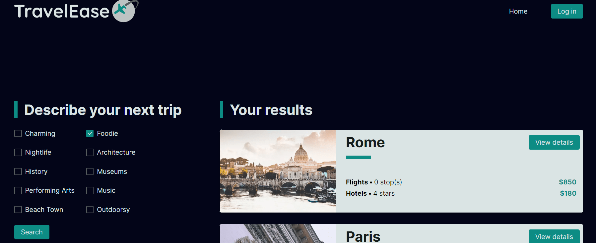

# Travel Ease

A travel planning application created as part of a technical assessment.

## 💻 About the project

Travel Ease was developed as part of a **DevEx Engineer** coding exercise during a job interview process.

The main goal of this project was not to ship a fully-featured product, but to demonstrate how I approach problem-solving, architectural decisions, and technical documentation.

The application explores how a travel planner could recommend destinations based on user preferences (such as activities), while also suggesting flight and hotel options based on pricing.

The original problem statement and requirements provided for the exercise can be found in the `docs/requirements.md` file.

## 🔍 What this project focuses on

Rather than feature completeness, this project was designed to showcase:

- how I break down product requirements
- how I structure a frontend application
- how I document technical decisions and trade-offs
- how I think about scalability and future extensions
- how I communicate ideas through code and documentation

Some features and roadmap items were intentionally speculative, serving as a way to express design reasoning, not concrete implementation plans.

## 🧭 Implemented scope

Within the scope of the exercise, the project includes:

- a Next.js-based frontend application
- activity-based destination exploration
- mock data for flights and hotels
- basic recommendation logic
- a structured and documented codebase

The implementation prioritizes clarity and structure over production-level completeness.

## 📐 Architecture & tooling

This project uses a modern frontend and tooling stack, including:

- Next.js
- React
- Styled Components
- Jest and React Testing Library
- Prisma and MongoDB (with mocked data)
- Docker for containerization
- GitHub Actions for CI
- Terraform for infrastructure exploration

The infrastructure and CI/CD setup were included to align with the exercise requirements and to demonstrate how I would approach real-world deployment scenarios, even though this project itself is not intended to be maintained or deployed long-term.

## 📋 About the documentation

For historical context, the original README written during the interview exercise is preserved in the `docs/` folder.

This repository contains additional documentation created as part of the coding exercise, including:

- a technical roadmap
- planning notes

These documents were written to demonstrate reasoning, trade-offs, and planning skills during the interview process.

They should be read as design and thought exercises, not as an active or future development plan.

## 🌟 Current state

- Project status: **finished** 🎉
- Next steps: no planned next steps.

## 📃 License

This project is licensed under the MIT License. See [LICENSE](./LICENSE) for more information.

---

🌱
