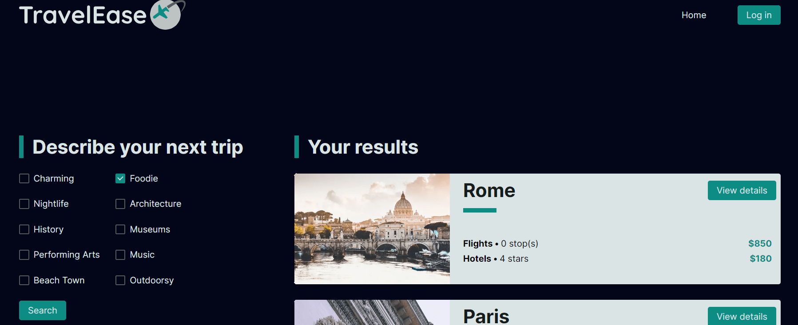

<h1 align="center">Travel Ease</h1>

A travel planning application for exploring destinations and finding flight and hotel options.

  <!-- build -->
  
  <!-- license -->
  
  <!-- languages -->
  
  <!-- top language-->
  

  

  <a href="#-about-the-project">About the project</a> •
  <a href="#-features">Features</a> •
  <a href="#️-technologies">Technologies</a> •
  <a href="#-documentation">Documentation</a> •
  <a href="#-license">License</a>

## 💻 About the project

Travel Ease is a travel planning application that helps users explore destinations based on their interests and find flight and hotel options.

The project was originally developed as part of a DevEx Engineer coding exercise during a job interview process for [SAS](https://www.flysas.com/en). The original requirements are preserved in [docs/requirements.md](./docs/requirements.md).

The application uses activity preferences to recommend destinations and provides mock flight and hotel options based on pricing.

The project was developed with a focus on application structure, technical decisions, and documentation, rather than production-level feature completeness.

## ✨ Features

- Explore destinations based on activities
- Recommend destinations according to user preferences
- View available flight options
- View available hotel options
- Compare options based on pricing

## 🛠️ Technologies

- Next.js
- React
- Styled Components
- Jest
- React Testing Library
- Prisma
- MongoDB
- Docker
- GitHub Actions
- Terraform

## 📚 Documentation

- [Requirements](./docs/requirements.md) — original requirements for the coding exercise
- [Technical roadmap](./docs/technical-roadmap.md) — technical improvements and future possibilities
- [Planning](./docs/planning.md) — project planning and implementation notes
- [Original README](./docs/README-original.md) — README created during the original coding exercise

## 📃 License

This project is licensed under the MIT License. See [LICENSE](./LICENSE) for more information.

---

🌱 Crafted by [Fernanda](https://github.com/f-ernanda)
